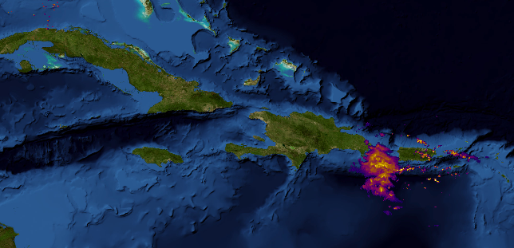
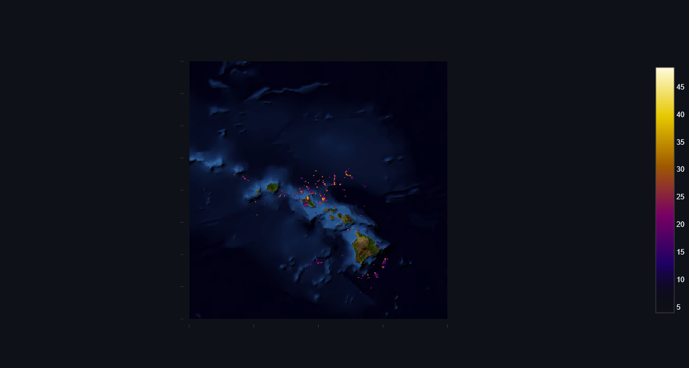

# NCEP Weather Radar Scraper + Explorer


## Goal
Goal of this project is to have a simple tool to create a dataset containing 2D weather radar data for training and evaluating predictive machine learning tasks.

## Overview
### Scraper
The scraper portion of the project is a simple python script, that scrapes [mrms.ncep.noaa.gov](https://mrms.ncep.noaa.gov/) and downloads files containing the radar data.

On the site, radar data is available for four different areas: mainland USA, caribbean, Hawaii and Alaska.

This script produces a file structure that looks like this in the target folder:
```
├── ALASKA
│   ├── 20251013
│   ├── ...
│   └── 20251022
├── CARIB
│   ├── 20251013
│   ├── ...
│   └── 20251022
├── CONTINENTAL
│   ├── 20251013
│   ├── ...
│   └── 20251022
└── HAWAII
    ├── 20251013
    ├── ...
    └── 20251022
```
where each folder contains all files for one day.

### Explorer
The explorer portion of the project contains a streamlit based UI, that shows an overview over the dataset, showing which dates in the year have how many files for each subdataset. Additionally it enables one to load one file and show the radar data in an interactive plot.



Note that there are two Map providers you can choose from, but please respect their policies for tile downloads. Alternatively edit the code and use your own tile server.

## Installation
For easy setup, everything is wrapped in a simple docker compose script: [docker-compose.yml](docker-compose.yml). You will need to edit the volume and optionally the port definitions to suit your setup.

## Outlook
- Integrate data from the dwd: [https://opendata.dwd.de/weather/radar/composite/dmax/](https://opendata.dwd.de/weather/radar/composite/dmax/)
- build actual dataset for training from raw files